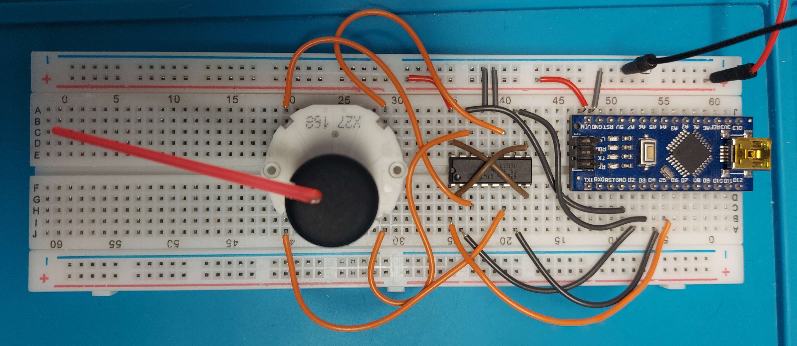

# Gauge Cluster Controller

Currently, we have a breadboard circuit controlling the X27.168 stepper with a driver IC and an Arduino Nano. The goal is to design a PCB which can drive four stepper motors. The MCU will receive data from the ECU over CAN bus. The circuit will be powered directly from the battery, so the board will regulate the input to 5V and protect the sensitive components. The schematic for the board is nearly complete, and soon we can start laying out components and routing traces.

